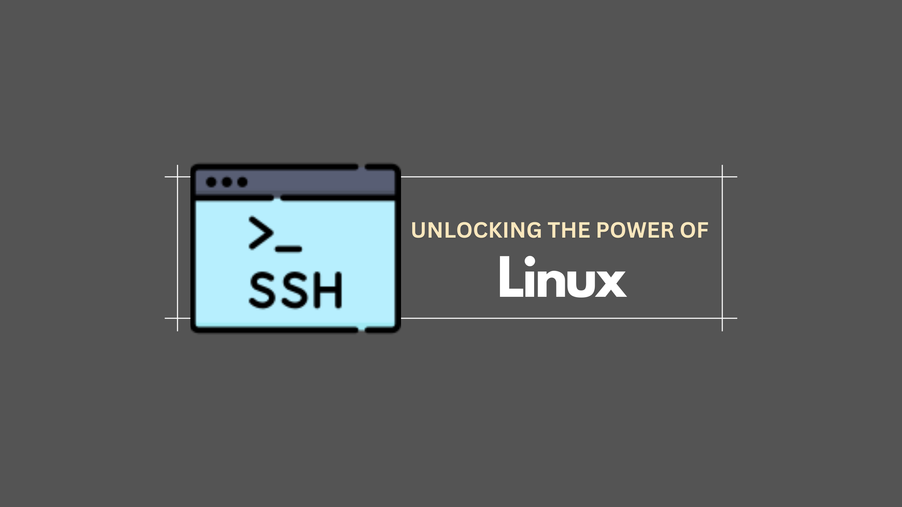

# # Unlocking the Power of Linux: A Hacker's Guide to Mastering the Basics

## Introduction
Welcome to the first installment of our journey into the world of Linux, where we'll uncover the secrets of this powerful operating system through the lens of hacking. Whether you're a curious beginner, an aspiring cybersecurity professional, or just someone passionate about technology, this series will guide you through the essential skills and knowledge you need to master Linux. We'll be using the renowned book "Linux Basics for Hackers" as our roadmap, breaking down complex concepts into digestible and engaging lessons. Get ready to dive deep into the command line, explore the intricacies of file systems, and unleash the full potential of Linux. Let's embark on this adventure together and transform your understanding of the digital world!
