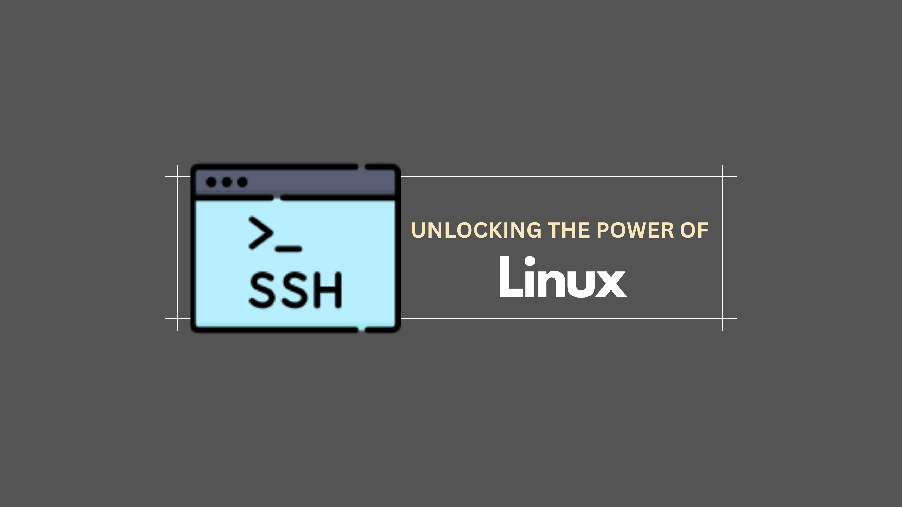

# Master Software Management in Kali Linux



*Essential guide to mastering software management in Kali Linux. Install, update, and remove tools with ease for a secure system.*

## The Power of APT: Your Go-To Package Manager

APT (Advanced Packaging Tool) is the default package manager for Debian-based distributions, including Kali Linux. APT simplifies installing, updating, and removing software. Let’s dive into some common APT commands:

1. **Searching for Packages:** Before installing software, it’s wise to search for the package to ensure it’s available in the repositories.

```bash
sudo apt-cache search <package_name>
```
For example, to search for the Metasploit framework, use:

```bash
sudo apt-cache search metasploit
```

2. **Installing Software:** Once you’ve found the package, install it using the **apt-get** command.

```bash
sudo apt-get install <package_name>
```

Installing Metasploit would look like this:

```bash
sudo apt-get install metasploit-framework
```

3. **Removing Software:** If you no longer need a package, remove it to free up space.

```bash
sudo apt-get remove <package_name>
```

To remove Metasploit:

```bash
sudo apt-get remove metasploit-framework
```

4. **Updating Packages:** Keeping your system up to date is crucial for security and performance. Update your package list with the following:

```bash
sudo apt-get update
```

5. **Upgrading Packages:** After updating the package list, upgrade your installed packages to their latest versions:

```bash
sudo apt-get upgrade
```

6. **Full Upgrade:** Sometimes, a more thorough upgrade is needed, which may involve installing or removing packages to satisfy dependencies:

```bash
sudo apt-get dist-upgrade
```

## Adding Repositories: Expanding Your Software Horizons

By default, Kali Linux’s APT is configured with a set of repositories. However, you might occasionally need software from other repositories. Adding a new repository involves editing the **sources.list** file.

1. **Open the sources.list file:**

```bash
sudo nano /etc/apt/sources.list
```

2. **Add a repository:** Insert the new repository line. For example:


```bash
deb http://http.kali.org/kali kali-rolling main contrib non-free
```

3. **Save and exit:** After editing, save the file by pressing **CTRL + O**, then **CTRL + X** to exit.

4. **Update the package list:**

```bash
sudo apt-get update
```

## Installing Software from Source: The Git Approach

Some tools are unavailable through APT and must be installed from the source. Git is a version control system that lets you clone repositories from platforms like GitHub. Here’s how you can do it:

1. **Cloning a Repository:**

```bash
git clone <repository_url>
```

For example, to clone a tool named **bluediving**:

```bash
git clone https://github.com/balle/bluediving.git
```

2. **Navigating to the Directory:** After cloning, navigate to the directory:

```bash
cd bluediving
```

3. **Building and Installing:** Most software will include instructions for building and installing it, typically in a **README.md** file.

```bash
sudo make install
```

This process might involve additional steps like configuring the build environment or resolving dependencies.

## Using GUI-Based Installers

While command-line tools are powerful, a graphical installer is sometimes more convenient, especially for beginners. Synaptic is a graphical package manager that can handle most APT tasks.

1. **Installing Synaptic:**

```bash
sudo apt-get install synaptic
```

2. **Launching Synaptic:**

```bash
sudo synaptic
```

Once launched, you can search for, install, and remove packages with a few clicks.

## Conclusion: Keep Your System Lean and Mean
Effective software management in Kali Linux is about more than just installing new tools; it’s about maintaining a streamlined, efficient system. Regularly update your packages, remove unused software, and explore new tools through additional repositories or source installations. With these skills, you’ll optimize your Kali Linux environment and be ready for any cybersecurity challenge.

## Scenario 

You need to install new software and update existing software on your system.

### Commands

apt-get update - Update Package Index

Explanation: This command updates the list of available packages and their versions.
Example: sudo apt-get update
Output: Fetches the latest package information from repositories.
apt-get install - Install Software Packages

Explanation: This command installs new software packages.
Example: sudo apt-get install nmap
Output: Installs the nmap package.
apt-get remove - Remove Software Packages

Explanation: This command removes software packages.
Example: sudo apt-get remove nmap
Output: Removes the nmap package.
apt-get upgrade - Upgrade Software Packages

Explanation: This command updates all the installed packages to their latest versions.
Example: sudo apt-get upgrade
Output: Upgrades all installed packages.

https://medium.com/dowusubekoe/subscribe
