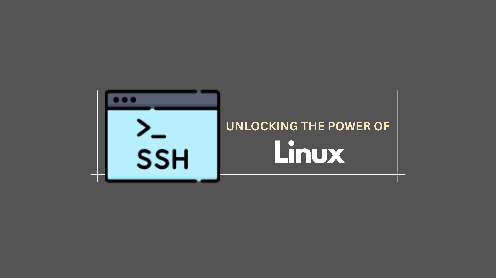

# Process Management

**What this tutorial is about:**

This lesson explains how to understand and manage *processes* in Linux.  Think of a "process" as a running program or task on your computer.  Everything you do – opening a web browser, editing a document, playing music – runs as a process. This tutorial will teach you how to:

*   **See what's running:** How to list and identify the processes that are currently active on your system.
*   **Control processes:** How to start, stop, pause, and resume processes.
*   **Manage resources:** How to understand what your processes are using (like CPU and memory)
*   **Deal with unresponsive programs:** How to "kill" or terminate processes that are misbehaving or frozen.

**Key Concepts for Beginners:**

*   **Process ID (PID):** Every process has a unique number called a PID.  This is like an ID card for the process.  You'll use PIDs to control specific processes.

*   **Commands:** The tutorial covers important commands for process management, including:

    *   `ps`: Shows you a snapshot of the currently running processes.  `ps aux` gives a more detailed view.
    *   `top`:  Provides a real-time, interactive view of your system's processes and resource usage (like CPU and memory consumption). This is great for finding out which processes are using the most resources.
    *   `kill`: Sends a signal to a process, usually to terminate it.  `kill <PID>` will usually stop a process. If it doesn't work, `kill -9 <PID>` is a stronger (but less graceful) option.
    *   `pkill`: Lets you kill processes by their name instead of their PID. For example `pkill firefox` kills all firefox processes.
    *   `bg`: Puts a process in the background.
    *   `fg`: Brings a background process to the foreground.
    *   `nohup`: Allows a process to continue running even after you close the terminal window it was started in. This is very useful for long-running tasks.

*   **Foreground vs. Background:**

    *   **Foreground:** When you run a program normally in the terminal, it runs in the foreground.  You can't use the terminal for anything else until that program finishes.
    *   **Background:** You can run a program in the background by adding an `&` at the end of the command (e.g., `gedit &`).  This allows you to continue using the terminal while the program runs.

*   **Signals:** When you use the `kill` command, you're sending a signal to a process.  The most common signal is `SIGTERM` (the default signal, which asks the process to terminate gracefully), and `SIGKILL` (signal 9, which forces the process to terminate immediately).

**Why this is important for beginners:**

*   **Understanding your system:** Knowing how to view and manage processes helps you understand what's happening on your Linux system.
*   **Troubleshooting:** When programs freeze or consume too many resources, you can use these tools to identify and fix the problem.
*   **Running tasks efficiently:** You can use background processes to run long tasks without tying up your terminal.

**How to use the tutorial:**

1.  **Read through the explanations:** Pay attention to the definitions and explanations of the key concepts.
2.  **Try the commands:** Open your Linux terminal and type in the commands that the tutorial shows.  Experiment with different options and arguments.
3.  **Practice:** The best way to learn is to practice. Try starting different programs, putting them in the background, and killing them.

**In Summary:**

The tutorial helps you understand and control the programs running on your Linux system. It gives you the tools and knowledge to see what's running, manage resources, and troubleshoot problems with processes. It's an essential skill for anyone learning Linux. Don't be afraid to experiment and practice!
